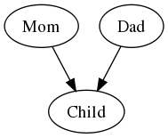
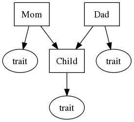

===================================================
Potential Information and Basic Experiment Planning
===================================================

Calculating Potential Information
---------------------------------

Let's calculate potential information for the simplest possible
case: two different normal distributions.  We'll use one as the
"true model" emitting the observations, and the other as our 
prediction.  Let's use the scipy.stats package for its convenient
methods for working with normal distributions::

   >>> from scipy import stats
   >>> model1 = stats.norm(10, 1)
   >>> model2 = stats.norm(12, 1)

Next, generate a random value sample of 100 observations from model 1::

   >>> obs = model1.rvs(100)

Now we compute the log-likelihood for the observations
under model 2, and the empirical entropy of the observations::

   >>> from darwin import entropy
   >>> Le = entropy.sample_Le(obs, model2)
   >>> He = entropy.box_entropy(obs, 7)

The second argument to box_entropy() is the number of 
data points to use as the sub-sample for density estimation.
From these values we can directly compute the potential
information::

   >>> Ip = -He - Le
   >>> print Ip.mean, Ip.get_bound()
   1.83278814202 1.18469794827

When called without any arguments, the get_bound() method returns
the 95% confidence lower-bound estimator.  By default, the information
metrics are calculated in "nats" (i.e. natural log base :math:`e`).
To express Ip in bits, we just need to apply the appropriate conversion
factor::

   >>> import math
   >>> print Ip.mean / math.log(2), Ip.get_bound() / math.log(2)
   2.6441543635 1.70915785493

Next let's apply this to a simple genetics problem.

Why RoboMendel is Bored
-----------------------

RoboMendel has grown pea plants for 5 years, and has seen many, many
pea flowers, all of them purple.  The poor guy is bored.
This is because he sees no potential information in his observations.
Each year he observed 20 plants, each with 100 flowers::

   >>> truePu = stats.norm(10, 1)
   >>> obsPu = truePu.rvs(5 * 20 * 100)

He constructs a model from his observations::

   >>> import numpy
   >>> mean = numpy.average(obsPu)
   >>> var = numpy.average(obsPu * obsPu) - mean * mean
   >>> modelPu = stats.norm(mean, math.sqrt(var))

He collects a new set of observations this year.
Next he calculates the empirical entropy of the observations,
and the empirical log-likelihood::

   >>> obsNew = truePu.rvs(20 * 100)
   >>> He = entropy.box_entropy(obsNew, 7)
   >>> Le = entropy.sample_Le(obsNew, modelPu)

From this he calculates the potential information of the observations
relative to his model::

   >>> Ip = -Le - He
   >>> Ip.mean
   -0.003343603207393906
   >>> Ip.get_bound()
   -0.031671209796191716

Evidently, there is no more information to be gained by improving
his model.

A Surprising Observation
------------------------

But while tending his pea plants, something catches RoboMendel's
robotic eye: a *white* pea flower!  Why does it "catch" his eye?
Because it signals potential information::

   >>> obsQuick = plantWh.get_phenotypes()[0].rvs(1)
   >>> obsQuick
   array([-1.41985693])

Pretty darn white.  To calculate *Ip* he combines it with the 
other observations, and redoes the calculation::

   >>> allObs = numpy.concatenate((obsNew,obsQuick))
   >>> He = entropy.box_entropy(allObs, 7)
   >>> Le = entropy.sample_Le(allObs, modelPu)
   >>> Ip = -Le - He
   >>> Ip.mean
   0.02530458797888565

This signals the presence of *positive* potential information.
Of course this can be localized to his new observation::

   >>> allObs[-1]
   -1.4198569271863846
   >>> -Le.sample[-1] - He.sample[-1]
   58.321937043903041

Holy schnikees!  58 nats of *Ip* from one observation?  Compare
that with one of his typical previous observations::

   >>> -Le.sample[0] - He.sample[0]
   -0.84541352546760873

Of course, a single observation doesn't give him confidence that
he has strong potential information, as the 5% confidence lower
bound shows him::

   >>> Ip.get_bound()
   -0.071098984744074889

This indicates strong expectation *Ip* for collecting a large
sample of observations from the "wierd" pea plant: he expects to
produce up to 58 nats of *Ip* by raising the lower bound of
his confidence interval.  So he obtains another 100 observations::

   >>> obsWh = plantWh.get_phenotypes()[0].rvs(100)
   >>> He = entropy.box_entropy(obsWh, 7)
   >>> Le = entropy.sample_Le(obsWh, modelPu)
   >>> Ip = -Le - He
   >>> Ip.mean
   50.203558792565801
   >>> Ip.get_bound()
   47.207416983257303

This tells RoboMendel that he's discovered a new set of 
observations that convincingly do not fit ``modelPu``.

Testing a Simple Fix
--------------------

RoboMendel always tries the simplest fix first.  In particular,
he constructed his old model by simply training on the past data,
and tested it by measuring how well it predicts new observations.  This
amounts to assuming that all the observations were emitted I.I.D.
from the same distribution.  He can do the same thing with the
new observations.  In his garden, his training data show
that approximately 10% of the flowers are white, vs. 90% are purple.
He trains a new model approximately as follows::

   >>> mean = numpy.average(obsWh)
   >>> var = numpy.average(obsWh * obsWh) - mean * mean
   >>> modelWh = stats.norm(mean, math.sqrt(var))
   >>> import mixture
   >>> modelMix = mixture.Mixture(((0.9, modelPu), (0.1, modelWh)))

To assess whether this model is an improvement over his old
model, he calculates the empirical information gain::

   >>> LeMix = entropy.sample_Le(obsWh, modelMix)
   >>> Ie = LeMix - Le
   >>> Ie.mean
   47.821464796147559
   >>> Ie.get_bound()
   44.806512600644481

This provides a convincing demonstration that RoboMendel should abandon
the old ``modelPu`` (which asserts that no white flowers exist),
in favor of the new mixture model.  One way of describing this is
that the mixture
model has converted approximately 45 nats of *potential information*
into *empirical information*, i.e. a measurable improvement in 
prediction power.

Can RoboMendel rest easy after his success?
He now calculates the potential information for the mixture model
from his "wierd" plant::

   >>> Ip = -LeMix - He
   >>> Ip.mean
   2.3820939964182544
   >>> Ip.get_bound()
   2.2479290384886377

This strong potential information reflects a basic mismatch
versus the model: the flower colors do not appear to be drawn I.I.D.
Instead of each flower having a 10% chance of being white, RoboMendel
sees that on certain plants, *all flowers* are white
(the precise value of *Ip*
indicates that white flowers are occuring about 10 times more frequently
than the model says they should), whereas on the
remaining plants *all flowers* are purple.  Indeed the purple plants
also show strong *Ip* vs. this model::

   >>> He = entropy.box_entropy(obsNew, 7)
   >>> Le = entropy.sample_Le(obsNew, modelMix)
   >>> Ip = -Le - He
   >>> Ip.mean
   
   0.10201691139077627
   >>> Ip.get_bound()
   0.073689305323023341

Evidently, a more sophisticated model is required.

Intrinsic vs. Extrinsic Models
------------------------------

There are two possible explanations for the flower color trait:

* either it is an *intrinsic* part of the heritable state of
  an individual plant (i.e. it is a *genetic* trait);

* or it is *extrinsic* to the heritable state of a plant (i.e.
  some random or environmental factor causes it; it cannot be
  inherited from plant to plant).

We will test simple models for both of these possibilities:

* **model A**: *Wh is a distinct species*.  Let's assume that we
  start with no concept of genetics except the simple idea of *species*,
  i.e. distinct *kinds* of plants and animals that can reproduce.
  Specifically, mating a male and female of the same species produces
  a new individual of that species; mating different species yields
  no progeny.  Under this extremely simple assumption, species are
  our only "container" for heritable variation, so if we want to
  model the white flower color trait as heritable, we simply assert
  that it constitutes a distinct species.  (Note that according
  to our simplistic model, that predicts that crossing it with
  purple-flowered plants should therefore yield no progeny).

* **model B**: *Wh is the same species as Pu*.  Here we assert
  that the flower color trait (white vs purple) is just an
  independent variable that gets set randomly for each
  individual plant, but not passed on from parent to child.
  
A Simple Crossing Experiment
............................

To make this completely concrete, let's examine how these
models apply to a simple experiment where we cross two
plants and then try to grow one seed from that cross.

Model A
+++++++

   *Model A: Wh is a distinct species*

   *Each node can have two possible states (Wh, with 10% probability,
   or Pu, with 90% probability), and emits an
   observable flower color.  We use the following conditional 
   probabilities for the child's state depending on the mom and dad
   (the precise values are arbitrary but illustrate the basic
   model)*:

   +--------+-----------------------+-----------------------+   
   |        |  Wh mom               | Pu mom                |
   +========+=======================+=======================+
   | **Wh** | p(Wh)=0.999,          | p(Wh)=0.002,          |
   | **dad**| p(no-progeny)=0.001   | p(Pu)=0.002,          |
   |        |                       | p(no-progeny)=0.996   |
   +--------+-----------------------+-----------------------+   
   | **Pu** | p(Wh)=0.002,          | p(Pu)=0.999,          |
   | **dad**| p(Pu)=0.002,          | p(no-progeny)=0.001   |
   |        | p(no-progeny)=0.996   |                       |
   +--------+-----------------------+-----------------------+   

Model B
+++++++

   *Model B: Wh is same species as Pu*

   *In this model, the Mom, Dad, and Child nodes (boxes) can only have
   one possible state (i.e. there is only one species),
   and do not directly emit any observations.  Instead they each
   generate an independent trait variable (oval nodes, with either 
   Wh state, 10% probability, or Pu state, 90% probability)
   that emit the flower color for that plant, but 
   which are not inherited by the progeny.*

Generating Experimental Crosses
+++++++++++++++++++++++++++++++

The robomendel module includes a simple simulator for generating
crosses.  Let's create a generic Wh plant and Pu plant,
then use them to generate experimental data for both the
:math:`Wh \times Wh` cross and the :math:`Wh \times Pu` cross::

   >>> from darwin.robomendel import PeaPlant
   >>> plantWh = PeaPlant(genome=PeaPlant.white_genome)
   >>> plantPu = PeaPlant(genome=PeaPlant.purple_genome)
   >>> from darwin import model
   >>> obsWW = model.ObsSet('Wh x Wh expt') # empty obs container
   >>> obsWP = model.ObsSet('Wh x Pu expt')
   >>> for i in range(100): # generate 100 independent crosses
           ww = (plantWh, plantWh, plantWh * plantWh)
           wp = (plantWh, plantPu, plantWh * plantPu)
           for j,var in enumerate(('mom', 'dad', 'child')):
               obsWW.add_obs(ww[j].rvs(1), var=var, matingID=i)
               obsWP.add_obs(wp[j].rvs(1), var=var, matingID=i)

Notes:

* ``PeaPlant`` uses the multiplication operator to generate a
  mating between two individuals.  This simulates meiosis
  (with random homologous recombinations) to produce a gamete
  from each individual, which are then combined to produce
  a child.

* Following the ``scipy.stats`` convention, ``PeaPlant`` also
  provides a random value sample method ``rvs(n)`` that generates
  *n* observations of the plant's trait(s) (in this case we have only
  defined one trait, flower color).

Computing Potential Information
+++++++++++++++++++++++++++++++

For convenience, let's define our statistical models for the flower
color distributions of *Wh* vs. *Pu* plants::

   >>> modelWh = stats.norm(0, 1) # obs likelihoods
   >>> modelPu = stats.norm(10, 1)

Next, let's write a function for computing the observation likelihoods
given a specific model::

   >>> def model_ll(model_f, obsSet):
           dg = model_f(modelWh, modelPu) # get the dependency graph
           m = model.Model(dg, obsSet) # compile the model
           logP = m.segmentGraph.p_forward(m.logPobsDict) # calculate prob
           f = m.segmentGraph.fprob[m.segmentGraph.start].f # forward prob dictionary
           return model.posterior_ll(f) # extract posterior log likelihoods

The ``model_f()`` function must take the obs likelihoods for the two
possible states (*Wh* and *Pu*), and build a dependency graph for the
desired model (i.e. the structures shown in the figures above).
The ``Model`` object compiles this structure in association with all
the observations (in this case, the same dependency structure must be
applied to each of the 100 individual crossing observations we generated).
Next we perform the forward probability calculation across the compiled
model; this analyzes the probability of all possible states that could
emit each observation.  We then extract these "forward probabilities"
to compute the *posterior log-likelihood* of each observation over
the entire model.  This computes the basic relation

.. math:: \log{p(X_t|\vec{X}_1^{t-1})} = 
          \log{\frac{\sum_i{p(\vec{X}_1^{t}, \Theta_t=s_i)}}
          {\sum_i{p(\vec{X}_1^{t-1}, \Theta_t=s_i)}}}

where :math:`X_t` is an individual observation;
:math:`\vec{X}_1^{t}` is the set of all observations up to 
and including this observation; :math:`\Theta_t` is a hidden
variable that emits observation :math:`X_t`;
and the summation is over all possible states :math:`s_i` 
of variable :math:`\Theta_t`.  The probabilities
on the right hand side are derived from the forward probability calculation.

Let's try using this on model A, which is provided by the module
``robomendel_test``::

   >>> from test import robomendel_test
   >>> llDict = model_ll(robomendel_test.family_model2, obsWW)

We can examine the log-likelihoods for individual observations directly
from this dictionary::

   >>> [llDict[obsWW.get_subset(matingID=i, var='mom')] for i in range(10)]
   [[-3.2236040377970485], [-3.2509613910274151], [-3.3303061994409058], 
    [-3.221659287142856], [-3.3531684127923658], [-4.0594417078133542], 
    [-3.348770052089499], [-3.8044193983051411], [-3.8099536775899785], 
    [-3.2598752679590914]]

What probability would we expect for this observation?  First,
the prior probability for the *Wh* state is 0.1::

   >>> math.log(0.1)
   -2.3025850929940455

We also need to consider the average log-likelihood expected
for our flower color observation.  We can get that directly from
the entropy of our flower color distribution::

   >>> -modelWh.entropy()
   -1.4189385332046727

So we expect an average log-likelihood of -3.72.  Our sample values seem
to agree with that.  What about for the child?  Our model A predicts
that once the parents are identified as *Wh* based on their observed
colors, the child is predicted to also be *Wh* with nearly 100% 
probability (see the conditional probability table for model A, above).
So the only factor in the child's log-likelihood should just be the entropy
of the ``modelWh`` flower color distribution, i.e. -1.42.
Let's check to see if our expectation matches the computed
data::

   >>> [llDict[obsWW.get_subset(matingID=i, var='child')] for i in range(10)]
   [[-1.7004544001681783], [-0.95334247250406623], [-1.5301061815537533], 
    [-1.4707527174357171], [-1.2022368200452291], [-1.0872465396198798], 
    [-1.5423841069048621], [-0.92329146186808231], [-1.8270622537676235], 
    [-1.0396214983569534]]

Yes!

Finally, let's compute potential information.  This is slightly
more complicated than our simple example at the beginning of
this tutorial, because these data are
multi-dimensional (i.e. each experimental observation consists of 
``(mom, dad, child)``).  First we need to compute the empirical
entropy :math:`H_e`, by extracting the experimental observations
as a list of tuples (one tuple for each ``matingID`` value)::

   >>> obsvec = obsWW.get_obstuple_list('matingID')
   >>> obsvec[0]
   array([ 0.06450444, -1.9897732 ,  1.24941216])

Note that these are the raw observation (flower-color) values, not
log-likelihoods.  We now pass them to our empirical entropy calculation,
which will treat them as a set of 3-dimensional points (i.e. their
density will be computed in a 3-dimensional space).  In other words,
we are calculating the empirical entropy of the joint probability
distribution :math:`p(mom, dad, child)`::

   >>> He = entropy.box_entropy(obsvec, 7)
   >>> He.mean / 3
   1.3604437401885947

This empirical estimate is close to the true theoretical
value based on the ``modelWh`` flower color distribution: 1.42 per plant.
The ``box_entropy()`` function implements the following estimator
for points :math:`\vec X_j` in a *d*-dimensional space:

.. math:: \overline{H_e} = -\frac{1}{N}\sum_{j=1}^N{\log{\frac{m-1}
   {(N-1)(r_{j:m} + r_{j:m-1})^d}}}

where we use the notation :math:`r_{j:m}=max_{i=1}^{i=d}(|X_{j:m,i}-X_{j,i}|)`
to indicate the radius (half side-length)
of the smallest *d*-dimensional hypercube
centered at point :math:`\vec X_j` that will contain its *m*-th nearest
neighbor;
:math:`X_{j,i}` means coordinate *i* of point :math:`\vec X_j`; and
:math:`X_{j:m,i}` means coordinate *i* of the *m*-th nearest
neighbor of point :math:`\vec X_j`.
It must be emphasized that
many more sophisticated estimators are also possible.

Finally, we need to package the posterior log-likelihood computed from
the model in the same form as our empirical entropy, i.e. one value
per ``(mom, dad, child)`` cross.  We can do that using the ``get_ll_list()``
convenience method.  We just tell it we want a separate value for
each value of the ``matingID`` tag, summed over all values of the
``var`` tag (i.e. "mom", "dad", "child")::

   >>> ll = obsWW.get_ll_list(llDict, iterTag='matingID', sumTag='var', 
                              -math.log(0.1 * 0.1))

The last factor is an adjustment we need to apply to reflect the fact
that rather than sampling our parent plants from the distribution
specified in the model (10% *Wh*, 90% *Pu*), we actually sampled
*Wh* plants with 100% probability for both parents (i.e. this is
a :math:`Wh \times Wh` experiment, after all!).  

We can check the value of our results::

   >>> Le = entropy.SampleEstimator(ll)
   >>> Le.mean /3
   -1.3758258359380033

Because this value is so close to :math:`-H_e`, we will get very little
if any potential information from this experiment::

   >>> Ip = -He - Le
   >>> Ip.mean
   0.046146287248223825
   >>> Ip.get_bound()
   -0.094745965042584881

This says we have no confidence that there is any potential information,
and poor prospects of getting much more even if we collect a larger 
sample size.

Note that in order to localize potential information to individual
observations, the ``He`` and ``Le`` input data must follow the
*exact* same observation order.  The ``get_obstuple_list()`` and
``get_ll_list()`` methods ensure that they indeed do so
(specifically, they are sorted by ``matingID``).

Testing the "Environmental Factor" Model
++++++++++++++++++++++++++++++++++++++++

We can compute the potential information for this experiment on another
model by simply calculating its empirical log-likelihood.  Let's do so
for model B, which explains the appearance of white vs. purple flowered
plants as a non-heritable, extrinsic factor (see figure above).
Again, we can obtain this model from the robomendel_test module::

   >>> llDict = model_ll(robomendel_test.environmental_model2, obsWW)
   >>> [llDict[obsWW.get_subset(matingID=i, var='child')] for i in range(10)]
   [[-4.0030394931622224], [-3.2559275654981112], [-3.8326912745477988],
   [-3.773337810429763], [-3.5048219130392733], [-3.3898316326139248],
   [-3.8449691998989071], [-3.2258765548621278], [-4.1296473467616694],
   [-3.3422065913509984]]

The *child* likelihood is lower than for the family model.  Why?  
In model A, once the parents are identified as *Wh* by the observational
data, the model predicts that the child should also be *Wh* with 
100% probability.  However, in model B the child's flower color is
completely independent of the parents', and just follows the population
mix (i.e. a 10% chance of having white flowers).  So its expected
log-likelihood is -2.30 - 1.42 = -3.72, which fits the data above.
On this basis we expect non-zero potential information for model B,
which we can easily verify by calculating it::

   >>> ll = obsWW.get_ll_list(llDict, iterTag='matingID', sumTag='var', 
                              -math.log(0.1 * 0.1))
   >>> Le = entropy.SampleEstimator(ll)
   >>> Ip = -He - Le
   >>> Ip.mean
   2.3487313802212864
   >>> Ip.get_bound()
   2.2078391279385174

Note that this potential information simply reflects the difference
between the model's prediction that the probability of white-flowered
children is 10%, versus the observation in this experiment that it is
actually 100% (i.e. :math:`\log(0.1)=-2.3`).

Note also that once we compute the empirical entropy :math:`H_e` for
an experiment, we can reuse that for calculating the potential 
information of many different models.

Analyzing the Wh x Pu Experiment
++++++++++++++++++++++++++++++++

Let's perform the same analysis for the :math:`Wh \times Pu` experiment.
First, we need to make a small adjustment to the ``family_model2``
model to make it conform to our model A.  Specifically, we need
to assert the probability of hybridization (successfully obtaining
progeny from a cross of two different species) to be
``pHybrid=0.002`` as specified in Model A (see table above).
We can do this without modifying our code above 
by creating a "wrapper function" that
passes this parameter to ``family_model2()``::

   >>> def my_family_model(modelWh, modelPu):
           return robomendel_test.family_model2(modelWh, modelPu, pHybrid=0.002)

Now we can compute the observation log-likelihoods, and examine
some values::

   >>> llDict = model_ll(my_family_model, obsWP)
   >>> [llDict[obsWP.get_subset(matingID=i, var='child')] for i in range(10)]
   [[-7.3729821068779584], [-7.387455860667675], [-7.464356101362366],
    [-9.8232047841673982], [-7.5045447464760873], [-8.4225208671526808],
    [-7.2002822302674989], [-7.5340847444872754], [-8.4048201434469796],
    [-7.1575274607305825]]

We can compute the average log-likelihood expected from theory.
First we need to calculate the ``pHybrid`` factor::

   >>> math.log(0.002)
   -6.2146080984221914

yielding a total expected value of -1.42 - 6.21 =  -7.63.
Note that the computed log-likelihoods seem to match this well.

Now let's compute potential information as before::

   >>> obsvec = obsWP.get_obstuple_list('matingID')
   >>> He = entropy.box_entropy(obsvec, 7)
   >>> He.mean / 3
   1.4104276753494582
   >>> ll = obsWP.get_ll_list(llDict, iterTag='matingID', sumTag='var', 
                              -math.log(0.1 * 0.9))
   >>> Le = entropy.SampleEstimator(ll)
   >>> Ip = -He - Le
   >>> Ip.mean
   6.2704755526763991
   >>> Ip.get_bound()
   6.0876746600673561

Note that the mean potential information matches almost exactly
the ``pHybrid=0.002`` factor (i.e. -6.21, see above).  Concretely,
what the potential information is telling us is that whereas our
model predicted we'd get progeny only 0.2% of the time, experimentally
we're getting progeny 100% of the time.  Note also that the empirical
entropy estimate is basically unchanged vs. the :math:`Wh \times Wh` 
experiment.  What's changed is just the observation log-likelihood,
specifically for the child.

We can also convert these potential information estimates to bits::

   >>> Ip.mean / math.log(2)
   9.0463839838617233
   >>> Ip.get_bound() / math.log(2)
   8.7826580426245808

